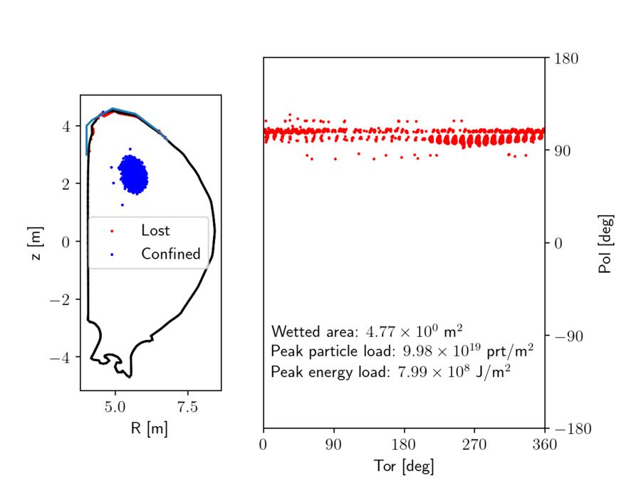
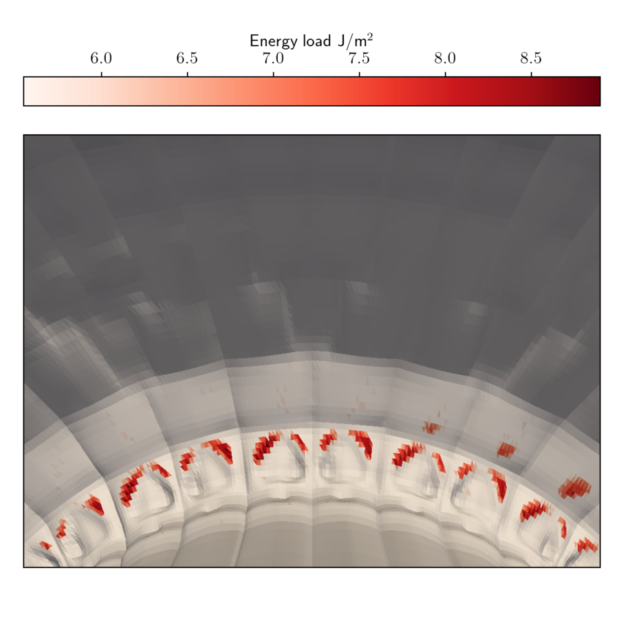
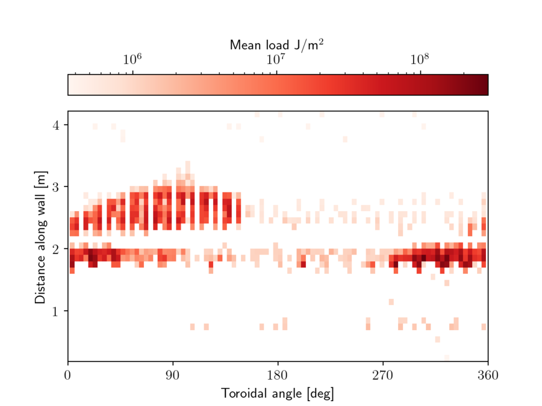
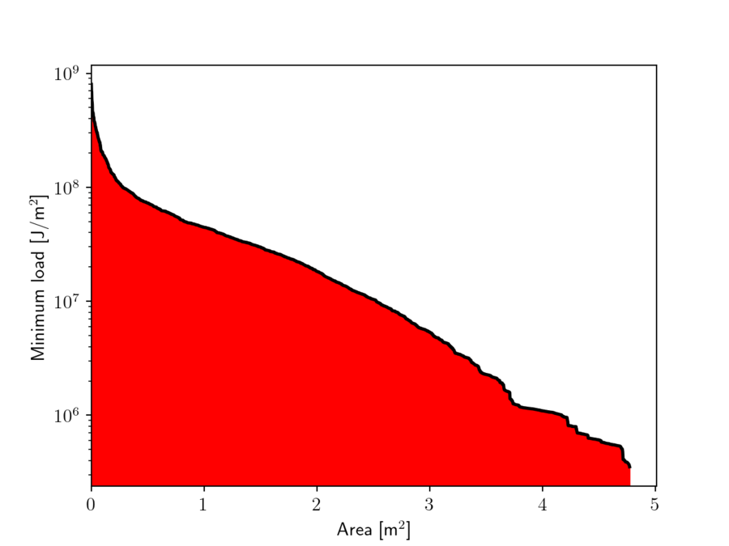
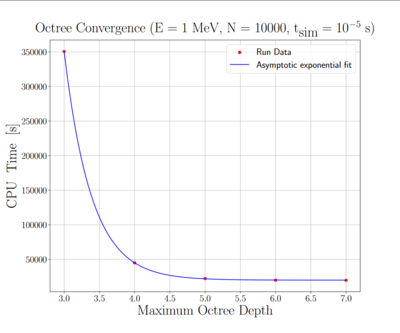

# How to assess wall loads with the particle tracker? 

## Note:
  * The wall collision check has been implemented fully only for relativistic particle and relativistic guiding center modes. For other modes the algorithm still exists but you can't get a full output without implementing how the particle energy is evaluated in the export routine (so this is a simple thing to do).
  * You'll need a triangular mesh that represents PFCs to use this module. If you don't have one, use this script to generate simple wall mesh from the edges of the JOREK computational grid.
  * See also the [internship report](./../../assets/wall_loads/internship_report_with_chapters.pdf) of Miko Skyllas.

### namelist2wall.py
```python

import numpy as np
import h5py

wall2d = np.genfromtxt("jorek_namelist",
                       dtype       = 'U',
                       delimiter   = ',',
                       skip_header = 113,
                       max_rows    = 371-114)

r = np.array([float(x.split("=")[-1]) for x in wall2d[:,0]])
z = np.array([float(x.split("=")[-1]) for x in wall2d[:,1]])

nr = r.size
nphi = 360

nodes = np.zeros(( nphi*(nr-1)*2*9, ))
for p in range(nphi):
    for i in range(r.size-1):
        idx  = p * (nr-1) * 2 * 9 + i * 2 * 9
        phi1 = p     * 2*np.pi / nphi
        phi2 = (p+1) * 2*np.pi / nphi

        x1 = r[i]   * np.cos(phi1)
        x2 = r[i]   * np.cos(phi2)
        x3 = r[i+1] * np.cos(phi1)
        y1 = r[i]   * np.sin(phi1)
        y2 = r[i]   * np.sin(phi2)
        y3 = r[i+1] * np.sin(phi1)
        z1 = z[i]
        z2 = z[i]
        z3 = z[i+1]
        nodes[idx:idx+9] = [x1, y1, z1, x2, y2, z2, x3, y3, z3]

        x1 = r[i+1] * np.cos(phi2)
        x2 = r[i+1] * np.cos(phi1)
        x3 = r[i]   * np.cos(phi2)
        y1 = r[i+1] * np.sin(phi2)
        y2 = r[i+1] * np.sin(phi1)
        y3 = r[i]   * np.sin(phi2)
        z1 = z[i+1]
        z2 = z[i+1]
        z3 = z[i]
        nodes[idx+9:idx+18] = [x1, y1, z1, x2, y2, z2, x3, y3, z3]

ntriangle = nphi*(nr-1)*2
with h5py.File('wall2d.h5','w') as h5:
    h5.create_dataset("ntriangle",  (1,),              data=ntriangle, dtype='i4')
    h5.create_dataset("nodes",      (ntriangle*3*3,),  data=nodes,     dtype='f8')

import matplotlib.pyplot as plt
plt.plot(r,z,color='red')
plt.scatter(np.sqrt(nodes[0::3]**2 + nodes[1::3]**2 ), nodes[2::3], 1)
plt.gca().set_aspect('equal', 'box')

plt.show()
```


## 1. Input

The input consists of a simple HDF5 file that has two datasets: **ntriangle** indicating number of wall elements (triangles) and **nodes** which is an array of triangle nodes in a format [x1_1, y1_1, z1_1, x2_1, y2_1, z2_1,x3_1, y3_1, z3_1, x1_2, y1_2, z1_2, ...], where the last index is triangle ID.

Easy way to construct input is e.g. by reading the data (usually in stl or vtk format) with pyvista, and converting it to desired format:

### readstl.py
  
```python 
import numpy as np
import pyvista as pv

mesh = pv.read('mesh.stl')
# If you have multiple files you can merge and scale like this (units are assumed to be in meters in the wall input)
#mesh = meshes[0].merge(meshes[1:]).scale([1/1000.0, 1/1000.0, 1/1000.0], inplace=False)
faces = mesh.faces.reshape((-1, 4))[:, 1:]
nodes = mesh.points[faces]
ntriangle = nodes.shape[0]
nodes = np.transpose(nodes,(0,1,2)).ravel()

with h5py.File('wall.h5','w') as h5:
    h5.create_dataset("ntriangle",  (1,),              data=ntriangle, dtype='i4')
    h5.create_dataset("nodes",      (ntriangle*3*3,),  data=nodes,     dtype='f8')

```

Include the wall mesh in your run folder.
## 2. Running a simulation with wall collision checks 

The implementation of the module can be found in particles/mod_wall_collision.f90. To use this module in a particle simulation, begin by initializing the wall data.
```
type(octree_triangle) :: octree ! The struct containing the wall data.
call mod_wall_collision_init('wall.h5', octree, max_depth)
```
To check wall collisions at each time step, use (inside the simulation loop)
```
call mod_wall_collision_check(p, q, octree, wall_id, wall_pos)
```

where p is the marker position at the beginning of the time step (in cylindrical coordinates) and q at the end of the time step. The subroutine returns id of the wall element that was hit (zero otherwise) and the impact point as p + t * (q - p) where parameter t is determined by the collision check. The wall element id corresponds to the position of the element in the input file.

Free resources with
```
call mod_wall_collision_free(octree)
```

You can export the data with
```
call mod_wall_collision_export(sim, file)
```

Note that this assumes that (for lost markers) you have stored the data as i_elm = (-1) * wall_id. The minus sign is there just to notify that the marker is lost.

An example script can be found in particles/examples/example_wallload.f90
## 3. Output and post-processing 

For the output the module creates a HDF5 file that contains:
  * IDs (i.e. index in the original input array starting from 1) of the wetted elements.
  * Particle load (prt/m^2) on each wetted triangle. The particle load is counted as sum(weight) / area of the element, where sum is over all particles that hit the element.
  * Heat load (J/m^2) on each wetted triangle. The heat load is counted as sum( particle weight * particle energy) / area of the element.

Optionally, one can also output the particle restart file, where i_elm indicates the end state of the given marker (>0 confined, =0 was lost but did not hit wall, < 0 triangle ID (multiplied with -1 to indicate the marker was lost) where this marker was lost).

The post-processing script is util/plot_wallload.py that will output the wetted area, and maximum particle and heat loads. The script requires wall input, wall loads and optionally also the particle restart file. The script also visualizes the losses (note that the default settings are for ITER):

<p float="left">
  
  
</p>

(**Left**) Scatter plot of marker final positions. (**Right**) Loads on the 3D wall mesh

<p float="left">
  
  
</p>

(**Left**) Load pattern on the wall. Note that these losses are projected on the blue curve shown in the first figure, so this figure does not show exact losses or their distribution but just the general pattern. (**Right**) Histogram showing area affected at least by the given heat load.


## 4. Description of the algorithm 

The algorithm is relatively simple. At each time-step, the line segment between the marker new and old positions is used to perform ray-tracing with respect to wall triangles using Möller-Trumbore algorithm. To optimize the process, ray tracing is only performed against triangles that are in close proximity. This is accomplished by recursively dividing the volume into eight quadrants, and only checking collisions against those triangles that are inside the same volume(s) as the marker new or old position. This //octree// is built upon initialization, and it's effectiveness can be seen in the following plot (for simulations max_depth=6 is recommended):




